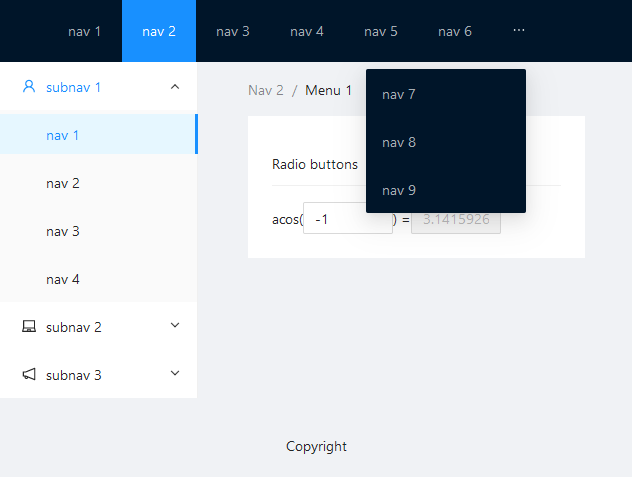
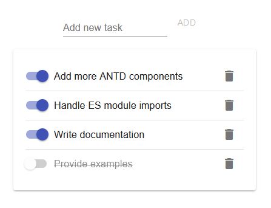

Create and run a React app directly from Python.

React components can be imported from popular libraries such as `antd` and `material-ui`.




See the `examples` folder for these examples.

Currently in an early development stage.

# Basic usage

Your app must be organised as a nested function. The outer function should be `async` and returns the inner function, which must be `async`. The outer function defines the global scope of the app, and shares state between clients; see the `global_rte.py` for an example.

```python
async def outer_scope():

    async def inner_scope():
        return await pyact.html.div(children="Hello")

    return outer_scope
}
```

The inner function defines the react components that will be shown to the client as well as any state that is local to that client. The rule of thumb is that you should always `return await` other components and `async` functions you define.

You can also define these functions out of line if you wish:
```python
async def inner_scope():
    return await pyact.html.div(children="Hello")

async def outer_scope():
    return outer_scope
}
```

You can find basic HTML components in `pyact.html`. There is also `pyact.antd` and `pyact.material_ui`. You can create your own components using `pyact.element`, see `global_rte.py` for an example.

The `id` parameter is the HTML/CSS id. The `key` specifies a react key. The `children` parameter can either be a string, a single child component, or a list that can contain strings, child components, or `None`s that will be automatically removed. If `children=None` then the component will be declared as a void element.

The `props` parameter should be a dictionary that gives the props for the component. Props can also be given as additional keyword arguments to the component; the `props` argument overrides these keyboard arguments and can be used for props that can't themselves be written as legal python function arguments.

# Managing state

To define state, use `pyact.state`:
```python
async def inner_scope():
    state, set_state = await pyact.state('state identifier', initial_value)

    return await pyact.html.div(children=[pyact.html.b(children="state: " + state)])
```

Again, the rule of thumb here is to `await` the state declaration. The first argument is a string that identifies the state variable, the second is the initial value of the state.

If you use the same identifier across declarations, the state variable will be shared. This is true even for other `async` functions. In the following example, the two state variables will be tied together:
```python
async def custom_component():
    state, set_state = await pyact.state('state', "this initial value will be ignored")

    return await pyact.html.b(children="state: " + state)

async def inner_scope():
    state, set_state = await pyact.state('state', "hello")

    return await pyact.html.div(children=[custom_component()])
```

To separate the variables, you can either change the identifiers for one of the declarations, or use `pyact.scope` (again note the `await` in the `with`):
```python
async def custom_component():
    with await pyact.scope('my component'):
        state, set_state = await pyact.state('state', "world")

        return await pyact.html.b(children="state: " + state)

async def inner_scope():
    state, set_state = await pyact.state('state', "hello")

    return await pyact.html.div(children=[custom_component()])
```

Alternatively, specifying a react key for a component will scope all child components:
```python
async def custom_component():
    state, set_state = await pyact.state('state', "world")

    return await pyact.html.b(children="state: " + state)

async def inner_scope():
    state, set_state = await pyact.state('state', "hello")

    return await pyact.html.div(key='my div', children=[custom_component()])
```

Finally, declaring scope in the outer function creates a global state variable that is common to all clients:
```python
async def outer_scope():
    global_state, set_global_state = await pyact.state('global', "hello world")

    async def inner_scope():
        return await pyact.html.div(children="Global: " + global_state)

    return outer_scope
}
```

# Callbacks

Callbacks can be created using `pyact.callback`:
```python
async def controlled_input():
    value, set_value = await pyact.state('value', "")

    return await pyact.antd.Input(
        value=value, 
        onChange=pyact.callback(set_value, ['e.target.value'])
        )
}
```

The first argument to `pyact.callback` should be either an `async` function or a regular function (such as `set_value` above); regular functions are automatically wrapped by `async`.

The second argument is a list that defines the arguments that your function will be called with. The elements of this list specify what information will be passed back to python and into your function. You will need to look up the API of the component to find out exact what this should be. For example, in ANTD, the `Input` component needs `e.target.value` to get the input value, while the `InputNumber` component needs just `e`. 

This emulates the javascript callbacks
```javascript
function Input_onChange(e) {
    return e.target.value;
}

function InputNumber_onChange(e) {
    return e;
}
```
(In fact, the first identifier before the `.`, which is `e` in these examples is always mapped to the first argument of the javascript callback.)

# External state

To interface with external state, create a `pyact.ExternalState` object. The first and only argument is the initial state. Then pass this object into your outer function and `await` it to get the value and modification function for the state:
```python
async def app(timer):
    time, set_time = await timer

    async def time_display():

        return await ...

    return time_display
```

As far as your app is concerned, this will behave like global state, but you can also access the state externally by using `timer.get` and you can change the state using `timer.set(new_value)`. See `external_time.py` for a full example. 

# Javascript function

You can also call javascript functions client side. Currently this is limited to props of components. Use `pyact.javascript_fn` where the first argument is the function to be called, and the remaining arguments will be passed to the javascript function. Eg:
```python
javascript_fn("Math.acos", value)
```

# Client updates

Whenever an update occurs, the entire app will be reevaluated to generate a new component tree that is sent to the client. Updates can occur for a number of reasons: client connections, and local state changes will send updates to that client alone; global state changes and external state changes will send updates to all connected clients.

# Starting the server

First, you must create the index HTML to be served, this can be done according to a provided template using the `pyact.index_html` function:
```python
index_html = pyact.index_html(
        "ws://{}:{}".format(address, port),
        title="Page title",
        crossorigin_scripts=[
            pyact.antd.ANTD_CDN,
            pyact.antd.ANTD_ICONS_CDN
        ],
        style_urls=[
            pyact.antd.ANTD_CSS_CDN
        ]
    )
```

The first argument is address of the server that the client will establish a websocket connection to. The `title` argument provides the page title. The `crossorigin_scripts` can be used to supply additional javascript imports for the components you wish to use. React is automatically imported, but an argument can be used to override the URLs if needed. The `style_urls` specifies CSS URLs for import. URLs are provided for `antd` and `material-ui`.

Next, the `starlette` framework must be created around the app:
```python
server_app = pyact.starlette.create_app(app, index_html)
```
The first argument is the `async` function that defines your app. The second is the previously created index HTML that will be served.

Finally, the server need to be started. This is done using `uvicorn` in the examples, but any library that interfaces with `starlette` will work here:
```python
uvicorn.run(server_app, host=address, port=port)
```